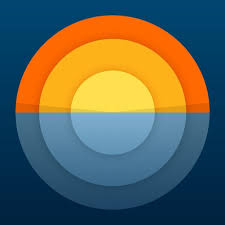

<a id="readme-top"></a>


[![Contributors][contributors-shield]][contributors-url]
[![Forks][forks-shield]][forks-url]
[![Stargazers][stars-shield]][stars-url]
[![Issues][issues-shield]][issues-url]
[![LinkedIn][linkedin-shield]][linkedin-url]


Welcome to the Solar Watch project! This repository is divided into two main parts: the backend and the frontend. You can access each part by clicking on the badges below the logo.


<br />
<div align="center">
  <a href="https://github.com/tolnabert/solar-watch">
    
  </a>
  <h3 align="center">Solar Watch</h3>
  <p align="center">
    A README to start my project!
    <br />
    <a href="https://github.com/tolnabert/solar-watch-backend">
      
    </a>
    <a href="https://github.com/tolnabert/solar-watch-frontend">
      
    </a>
  </p>
</div>


<details>
  <summary>Table of Contents</summary>
  <ol>
    <li>
      <a href="#about-the-project">About The Project</a>
      <ul>
        <li><a href="#built-with">Built With</a></li>
      </ul>
    </li>
    <li>
      <a href="#prerequisites">Prerequisites</a>
      <ul>
        <li><a href="#getting-started">Getting Started</a></li>
        <li><a href="#installation">Installation</a></li>
      </ul>
    </li>
    <li><a href="#usage">Usage</a></li>
    <li><a href="#roadmap">Roadmap</a></li>
  </ol>
</details>


## About The Project

Solar Watch is a web application designed to provide sunrise and sunset information for various cities. This project encompasses a backend developed with Java Spring Boot and a frontend built with React and JavaScript.

- <a href="https://trello.com/b/GluZg8SJ/solar-watch-si-project" target="_blank">Trello for the project</a>

Completed as part of the final module of my course, this project was developed during the self-directed weeks. It offers users the ability to register, log in, and obtain solar timings for any city by integrating with two external APIs:

- [OpenWeatherMap Geocoding API](https://openweathermap.org/api/geocoding-api)
- [Sunrise-Sunset API](https://sunrise-sunset.org/api)

By leveraging these APIs, Solar Watch delivers comprehensive solar information for specified locations. The application also includes secure endpoints reserved for admin users. Admins have the capability to add solar data not provided by external sources and review all stored solar information requests in the database.

<p align="right">(<a href="#readme-top">back to top</a>)</p>


### Built With

This section is listing  major frameworks/libraries use in my project.

* [![Node][Node.js]][Node-url]
* [![Javascript][Javascript.com]][Javascript-url]
* [![React][Reactjs.org]][Reactjs-url]
* [![PostgreSQL][Postgresql.org]][Postgresql-url]
* [![Java][Java.com]][Java-url]
* [![Spring][Spring.io]][SpringBoot-url]
* [![SpringSec][SpringSec]][SpringSec-url]
* [![Hibernate][Hibernate]][Hibernate-url]
* [![Express][Express.com]][Express-url]
* [![Docker][Docker.com]][Docker-url]
* [![Trello][Trello]][Trello-url]

<p align="right">(<a href="#readme-top">back to top</a>)</p>


### Prerequisites

Open a command prompt (CMD), PowerShell, or Terminal and run the following command to check if Docker is installed:
     ```
     docker --version
     ```
-  If Docker is installed, you'll see the version information.
-  If not, you'll need to install Docker Desktop for your operating system.
     - [Docker Desktop for Windows download page](https://www.docker.com/products/docker-desktop).

<p align="right">(<a href="#readme-top">back to top</a>)</p>


### Getting Started

To get started with the project, you may follow these steps:

1. **Clone the Repositories**

   Clone both the backend and frontend repositories using the following commands:

   ```
   git clone https://github.com/tolnabert/solar-watch-backend
   git clone https://github.com/tolnabert/solar-watch-frontend
   ```

2. **Navigate to the Project Directory**

  Move into the directory where your docker-compose.yml file is located. This file should be at the root level of your project folder.

  ```
  cd path-to-your-project-directory
  ```

3. **Start the Services**

Run the following command to build and start the Docker containers for both backend and frontend services:

  ```
  docker-compose up -d
  ```

4. **Verify Installation**

It is exposed, because not a deployed application, can have better view on the paplication
Backend: Access the backend service at http://localhost:8080.
Frontend: Access the frontend service at http://localhost:5008.

<p align="right">(<a href="#readme-top">back to top</a>)</p>


## Installation
Since the project is containerized with Docker, there are no additional installation steps required beyond having Docker and Docker Compose set up. The application is fully contained within Docker containers and can be started with docker-compose up -d.

<p align="right">(<a href="#readme-top">back to top</a>)</p>


### Usage

If you can access the http://localhost:5008, you can use the features.

- login
    - You may login as admin to access all features:
      ```
      username: admin
      password: secret123
      ```
    - or login with test user:
      ```
      username: testuser
      password: secret123
      ```
- register

As a user:
- search with a city name for solar information
    - country code country code divided by comma. Please use ISO 3166 country codes
    - state code (only for the US country)
- visit about us, contact, change password pages (not finished, not in scope to finish in this project)

As an admin:
- you can add solar information to be able to manage solar information that are not included for the external APIs.
- you can list all solar information that is in our database
    - a request that is not in our database will be saved to it, form next time the server will serve that.

<p align="right">(<a href="#readme-top">back to top</a>)</p>


## Roadmap

- [x] User Registration
- [x] User Login
- [x] Admin Role Security
  - [x] View All Solar Information
  - [x] Manually Add Solar Information
  - [ ] Delete Solar Information
- [x] CSS 
- [x] Multi-Layer Dockerization
- [x] Display Search Results in Chronological Order

<p align="right">(<a href="#readme-top">back to top</a>)</p>


<!-- MARKDOWN LINKS & IMAGES -->
<!-- BANNER -->
[contributors-shield]: https://img.shields.io/badge/CONTRIBUTORS_-1-green?style=for-the-badge
[contributors-url]: https://github.com/othneildrew/Best-README-Template/graphs/contributors
[forks-shield]: https://img.shields.io/badge/FORKS_-0-blue?style=for-the-badge
[forks-url]: https://github.com/othneildrew/Best-README-Template/network/members
[stars-shield]: https://img.shields.io/badge/STARS-0-blue?style=for-the-badge
[stars-url]: https://github.com/othneildrew/Best-README-Template/stargazers
[issues-shield]: https://img.shields.io/badge/ISSUES-0-yellow?style=for-the-badge
[issues-url]: https://github.com/othneildrew/Best-README-Template/issues
[linkedin-shield]: https://img.shields.io/badge/linkedin-%230077B5.svg?style=for-the-badge&logo=linkedin&logoColor=white
[linkedin-url]: https://www.linkedin.com/in/tolnabert

<!-- LINKS TO BACKEND AND FRONTEND -->
[Backend]: https://img.shields.io/badge/Backend_repository-%23007396?style=for-the-badge
[Backend-url]: https://github.com/tolnabert/solar-watch-backend  
[Frontend]: https://img.shields.io/badge/Frontend_repository-%23F7DF1E?style=for-the-badge
[Frontend-url]: https://github.com/tolnabert/solar-watch-frontend

<!-- TECHNOLOGIES -->
[Node.js]: https://img.shields.io/badge/node.js-6DA55F?style=for-the-badge&logo=node.js&logoColor=white
[Node-url]: https://nodejs.org/en
[Javascript.com]: https://img.shields.io/badge/TypeScript-007ACC?style=for-the-badge&logo=typescript&logoColor=white
[Javascript-url]: https://www.javascript.com/
[Reactjs.org]: https://img.shields.io/badge/React-20232A?style=for-the-badge&logo=react&logoColor=61DAFB
[Reactjs-url]: https://reactjs.org/
[Postgresql.org]: https://img.shields.io/badge/postgres-%23316192.svg?style=for-the-badge&logo=postgresql&logoColor=white
[Postgresql-url]: https://www.postgresql.org/
[Java.com]: https://img.shields.io/badge/Java-ED8B00?style=for-the-badge&logo=openjdk&logoColor=white
[Java-url]: https://www.java.com/en/
[Spring.io]: https://img.shields.io/badge/spring-%236DB33F.svg?style=for-the-badge&logo=spring&logoColor=white
[SpringBoot-url]: https://spring.io/projects/spring-boot
[SpringSec]: https://img.shields.io/badge/Spring_Security-6DB33F?style=for-the-badge&logo=Spring-Security&logoColor=white
[SpringSec-url]: https://spring.io/projects/spring-security
[Hibernate]: https://img.shields.io/badge/Hibernate-59666C?style=for-the-badge&logo=Hibernate&logoColor=white
[Hibernate-url]: https://docs.spring.io/spring-framework/reference/data-access/orm/hibernate.html
[Express.com]: https://img.shields.io/badge/express.js-%23404d59.svg?style=for-the-badge&logo=express&logoColor=%2361DAFB
[Express-url]: https://expressjs.com/
[Docker.com]: https://img.shields.io/badge/docker-%230db7ed.svg?style=for-the-badge&logo=docker&logoColor=white
[Docker-url]: https://www.docker.com/
[Trello]: https://img.shields.io/badge/Trello-0052CC?style=for-the-badge&logo=trello&logoColor=white
[Trello-url]: https://trello.com/
